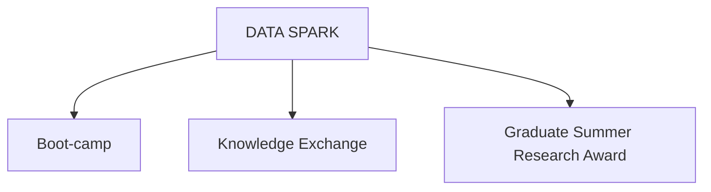

# DATA SPARK: an Initiative to Expand Data Literacy and Promote Data Champions at Tulane University

## Goal of proposal
The main objective of this document is to present a proposal for the expansion of programs the Connolly Alexander Institute for Data Science (CAIDS) at Tulane University currently provide by creating pathways to support data literacy among graduate students. This proposal presents two additional pathways, aside from the current Graduate Summer Research Award: Boot-camp and Knowledge Exchange. All under the umbrella of DATA SPARK.
## Summary Description of the Initiative

The Data Analytics Training and Apprenticeship - Student Program for Advanced Research Knowledge (DATA SPARK) program aims to support graduate students' training and professional development by sponsoring their development of core competencies in data science and related fields.  DATA SPARK supports graduate student training through three pathways:

- Boot-camp
- Knowledge Exchange
- Graduate Summer Research Award

## Learning Objectives

1. **Advanced Data Science Skills:** Enhance students' proficiency in data analysis, machine learning, statistical analysis and best practices following [FAIR principles](https://www.nature.com/articles/sdata201618).
2. **Practical Application:** Provide hands-on experience with real-world data sets and case studies.
3. **Collaborative Learning:** Foster collaboration among students, developers, professors, and industry professionals.
4. **Knowledge Transfer:** Enable students to effectively transfer their knowledge to their peers through workshops and tutorials.
5. **Professional Development:** Prepare students for careers in academia, industry, and research by enhancing their technical and soft skills.

### SPARK Boot-camp
The  SPARK Boot-camp is an in-person training program designed to equip graduate students with data science and computational skills, from beginner to advanced levels. The program invites graduate students to participate in a one or two-week course (depending on schedule), where they will receive intensive training from experienced professors and senior graduate students from Tulane. The content of the course will range from introductory data science with R and Python to advanced topics in machine learning and AI.

##### Participants
Participants will gain practical experience in data science by working with common datasets such as the Cars and Palmer Penguins, as well as their own research data. Each scientific field and its associated data present unique challenges. By engaging with datasets relevant to their interests, participants not only enhance their learning but also produce valuable deliverables that contribute to their research endeavors.

##### Instructors
This training course is led by a professor at Tulane and a senior graduate student. Professors are encouraged to propose a one or two week summer course their topic of interest or expertise. **Senior graduate students** are invited to propose a summer course jointly with faculty and participate as a teaching assistant or instructor of record. This presents a great opportunity to advance professional development and career goals. 

#### Boot-camp Application and Selection Criteria

##### Participants
- **Eligibility:** Open to graduate students for all departments.
*Register like any other course. Limited seats available.*
##### Instructors
- **Eligibility:** Open to professors and senior graduate students from all departments that use or apply computational and data science concepts in research and knowledge development. 
	- Professors: 
		1) Submit a proposal for a one or two week boot-camp. Use the [[#Boot-camp proposal guidelines]].

	- Senior graduate students: 
		1) Submit a proposal for a one or two week boot-camp. Use the following guidelines (Guidelines under development). 
		2) Collaborate with professor to develop boot-camp curriculum and establish if your participation will be as a research assistant or instructor of record.

##### Boot-camp deliverables and logistics
**Deliverables:** *These need to be presented withing the initial proposal. Documentation of these deliverables can serve as reference for future boot-camp applicants.*
- Comprehensive lesson plan
- Budget and use of resource plan
- Interactive exercises and case studies
- Assessment tools (quizzes, projects)
- Workshop materials (slides, handouts, code samples)
**Logistics:**
- Scheduling workshops in collaboration with SAC (Student Activities Council) and DRI (Data Research Institute)
- Securing venues and necessary equipment
 - Marketing and promotion of workshops
	 - Maybe be part of Data Week and Love Data Week
	 - Knowledge Exchange participants being part of either of these.
- Managing registrations and attendance

#### Boot-camp Proposal Guidelines
##### General Plan Requirements

- **Structure:** Clear objectives, step-by-step instructions, and expected outcomes
- **Content:** Relevant theoretical background, practical exercises, and real-world applications
- **Engagement:** Interactive components such as discussions, group work, and hands-on activities
- **Evaluation:** Methods to assess participants' understanding and skills
##### Proposal Selection criteria
Boot-camp course proposals will be reviewed by members of the Connolly Alexander Institute for Data Science (comprised of students, faculty, and staff) and selected for funding according to the following criteria: 
1. The boot-camp course must clearly demonstrate **collaboration** between students, faculty, and staff. 
2. The boot-camp course must support the mission of CAIDS.
3. The boot-camp course must demonstrate a clear benefit to the College community and provide opportunity for co-curricular learning that occurs outside of the traditional classroom.
5. The budget should be planned as a cost-effective use of grant funds and other Tulane resources and should not duplicate existing activities or programs. 
6. The boot-camp course must be a new topic or an expansion of an existing course or topic series. Priority will be given to new and innovative topics that focus on partnership building (on-campus and/or off-campus) and creative collaboration. 

### SPARK Knowledge Exchange

There are numerous courses, boot camps, and seminars dedicated to teaching data science and related fields. The Knowledge Exchange pathway aims to support graduate students by providing funding to participate in external training programs, seminars, conferences or similar events and subsequently share that knowledge at Tulane. The application process requires 1) a statement of interest explaining the event and its relevance to their research and career goals, 2) a CV/Resume, and 3) a brief proposal for a workshop or tutorial they plan to deliver upon their return. After completing their training, participants must present their acquired knowledge through a one-hour in-person or online workshop, a written tutorial, or a vignette to be included in the CAIDS GitHub repository for future reference. For training that requires access to code, participants are encouraged to share the source code on [CAIDS GitHub](https://github.com/caids-datalab) as long as it is public or original authors provide permission to share.

The funding provided by this program can be use to cover conference registration and add-ons (e.g. special workshop at conference not included in initial fees).
##### Ways to share knowledge 

Some ways of sharing participants' newly acquired skills could be:
- Organizing and presenting a workshop with student organizations (undergraduate or graduate), for example:
	- [Tulanians Who Enjoy R coding (TWERC)](https://tulanianswhoenjoyrcoding.wordpress.com/)
	- [SACNAS chapter](https://www.sacnas.org/chapters/chapter-directory)
	- [Cookies and Code](https://www.instagram.com/cookiesandcodetu/)
	- 
- Film Screenings
- Online tutorial or vignettes

#### Knowledge Exchange Application and Selection Criteria

- **Eligibility:** Open to graduate students from all departments.
- **Application Materials:** 
	1) Statement of interest, .
	2) CV/Resume, 
	3) brief proposal for a workshop or tutorial they plan to deliver.
- **Selection Criteria:** Research interests and professional development needs, relevance of the proposed workshop, and the potential impact on their home institution.

#### Knowledge Exchange Deliverables
**Deliverables**: 
- One-hour workshop (in-person or virtual)
- Tutorial or vignette (e.g. how to import and visualize data) in Markdown format
- Proposal for workshop
	- Some of the topics that Knowledge exchange participants can participate lend themselves to elaborate deeper and could be developed as a one or two-week boot-camp. We invitie participants to explore this possibility.
	- If this deliverable is chosen, see [[#Boot-camp Application and Selection Criteria]].

### Graduate Summer Research Grants 

The Connolly Alexander Institute for Data Science (CAIDS) invites Tulane University PhD and other doctoral students to submit applications for Summer Grants of up to $2000. Please note: _Applications that request funds for data collection or data acquisition (see eligibility criteria 4 below) are eligible to apply for up to $5000._

See further details [HERE](https://datainstitute.tulane.edu/graduate-summer-research-grants).
#### Graduate Summer Research Grants Application and Selection Criteria 
To be eligible, applicants must:

1. have advanced to doctoral candidacy, scheduled to defend their dissertation prospectus in Spring 2024, or have completed all coursework and begun research for their dissertation (or the equivalent) and
2. focus on or use data in their dissertations (or the equivalent).

Preference will be given to applications that request funds for data collection or access (see eligibility criteria 4 below), undergraduate research support, or expenses related to working with community partners. 

CAIDS defines “data” broadly, including not only quantitative data but also qualitative data, such as data obtained from interviews.

See further details [HERE](https://datainstitute.tulane.edu/graduate-summer-research-grants).

#### Graduate Summer Research Grants Deliverables

Grant recipients must submit a progress report to Meg Keenan at [mkeean@tulane.edu](mailto:mkeenan@tulane.edu?subject=Graduate%20Summer%20Research%20Grant%20-%20Progress%20Report) by October 31, 2024. The report should include a brief but informative summary of the progress made on the dissertation or equivalent project over the summer. Recipients who do not submit a progress report by this deadline will not be eligible for CAIDS Graduate Grants in the future.

## Topics for Boot-camps and Knowledge Exchange
*Workshops topics to be developed for Boot-camp or for participating through Knowledge Exchange pathway*. These topics are meant to serves as an example of what can be proposed as a boot-camp or partake in.  

- **Topics:**
    - Advanced Machine Learning Techniques
    - Data Visualization and Storytelling
    - Big Data and Cloud Computing
    - Bioinformatics and Computational Biology
    - Ethical Considerations in Data Science
    - Software Development for Data Science
    - Reproducibility and Data Science in R
- **Existing Workshops:**
    - Hands-on Python Programming
    - R for Data Analysis
    - Data Wrangling with SQL
    - Deep Learning with TensorFlow and PyTorch
    - Statistical Methods for Data Science
- **Conferences** 
	- [useR](https://www.r-project.org/conferences/)
	- [posit::conf](https://posit.co/conference/)
	- [CascadiaR](https://cascadiarconf.com/)
	- [Grace Hopper celebration](https://ghc.anitab.org/)

## How does CAIDS support to DATA SPARK initiative?
### Scheduling Workshops

- **Coordination:** Work with DAC and DRI to determine suitable dates and times
- **Promotion:** Use campus communication channels to advertise the workshops
- **Registration:** Implement an efficient registration process to manage participant sign-ups
- **Feedback:** Collect and analyze feedback from participants to improve future workshops

### Creation of Database of Opportunities

#### Develop resources and curriculum like:

[University of Arizona's Data Science Institute](https://datascience.arizona.edu/)
[University of Vermont's Biological Data Science (BilDS) Program](https://www.uvm.edu/quest)

- **Potential Events:** Host events such as: 
	- Conferences, 
	- Workshops
	- Symposia
	- data science competitions or hackathons
- **Wishlist Features:**
    - Event descriptions and objectives
    - Location and dates
    - Costs and funding options
    - Potential learning outcomes
    - Past participant reviews and feedback